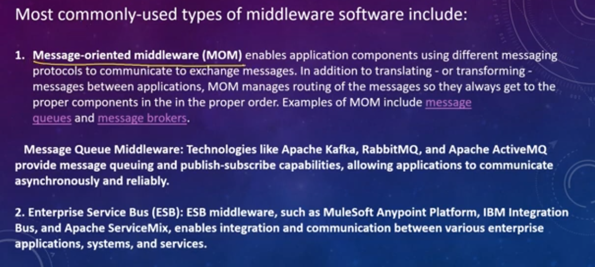

Middleware is `software` that acts as `a bridge` between an application's `backend and frontend` or `between different components` within the backend. It provides a way to intercept and process requests and responses as they move through the application stack. Middleware is commonly used to add functionality, modify behavior, or perform operations such as authentication, logging, error handling, and more.

 এখানে, ছবি ভিডিও আর আড বিভিন্ন server থেকে আসতেছে আর এদের কে সযুক্ত করার জন্য bridge হিসেবে middleware ব্যবহার করতেছি । 

 
`As FastAPI is based on Starlette and implements the ASGI specification, you can use any ASGI middleware.`
 
### `Asgi vs Wsgi`

 

  

# Example of MiddleWare:
 

 

 
 
